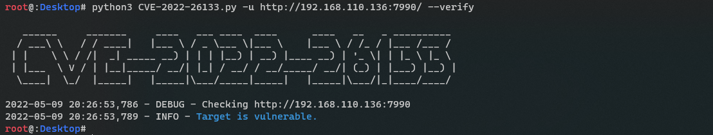
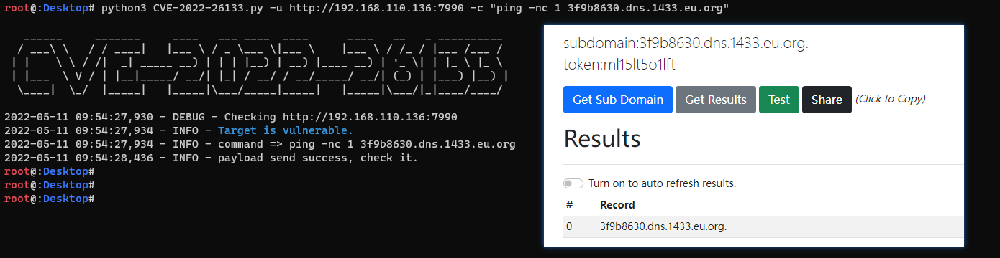
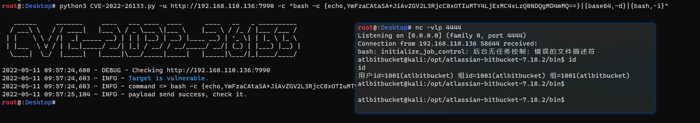

# CVE-2022-26133


## 说明

Atlassian Bitbucket Data Center 反序列化漏洞(CVE-2022-26133) 批量验证和利用


## 漏洞验证



批量

```
python3 CVE-2022-26133.py -u http://192.168.110.136:7990 -f target.txt
```


## 漏洞利用





***声明：该工具仅用于合法的，经过授权的渗透测试，公司内部安全检查与研究使用。由于使用本工具带来的不良后果由使用者本人负责。***

